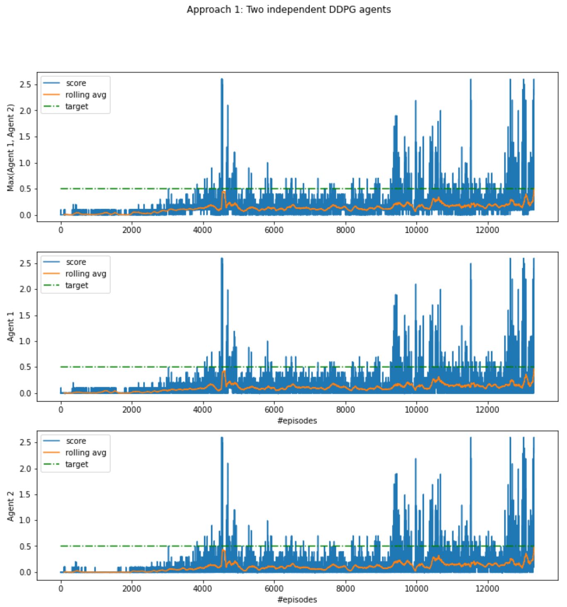
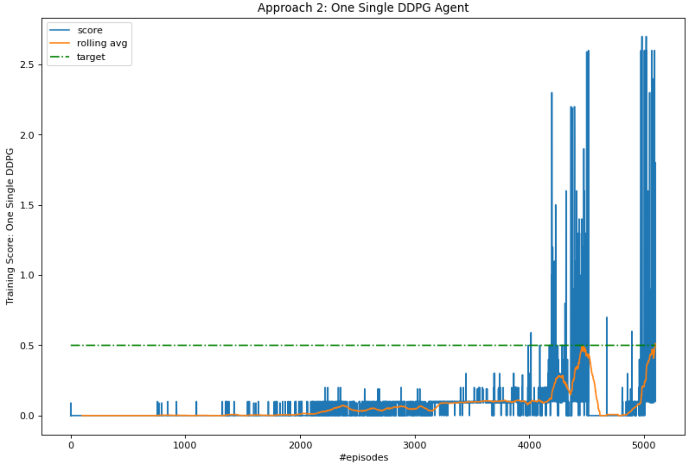

[//]: # (Image References)

[image1]: https://user-images.githubusercontent.com/10624937/42135623-e770e354-7d12-11e8-998d-29fc74429ca2.gif "Trained Agent"
[image2]: https://user-images.githubusercontent.com/10624937/42135622-e55fb586-7d12-11e8-8a54-3c31da15a90a.gif "Soccer"

# Project 3: Collaboration and Competition

### Introduction

For this project, you will work with the [Tennis](https://github.com/Unity-Technologies/ml-agents/blob/master/docs/Learning-Environment-Examples.md#tennis) environment.

![Trained Agent][image1]

In this environment, two agents control rackets to bounce a ball over a net. If an agent hits the ball over the net, it receives a reward of +0.1.  If an agent lets a ball hit the ground or hits the ball out of bounds, it receives a reward of -0.01.  Thus, the goal of each agent is to keep the ball in play.

The observation space consists of 8 variables corresponding to the position and velocity of the ball and racket. Each agent receives its own, local observation.  Two continuous actions are available, corresponding to movement toward (or away from) the net, and jumping. 

The task is episodic, and in order to solve the environment, your agents must get an average score of +0.5 (over 100 consecutive episodes, after taking the maximum over both agents). Specifically,

- After each episode, we add up the rewards that each agent received (without discounting), to get a score for each agent. This yields 2 (potentially different) scores. We then take the maximum of these 2 scores.
- This yields a single **score** for each episode.

The environment is considered solved, when the average (over 100 episodes) of those **scores** is at least +0.5.

### Getting Started

1. Download the environment from one of the links below.  You need only select the environment that matches your operating system:
    - Linux: [click here](https://s3-us-west-1.amazonaws.com/udacity-drlnd/P3/Tennis/Tennis_Linux.zip)
    - Mac OSX: [click here](https://s3-us-west-1.amazonaws.com/udacity-drlnd/P3/Tennis/Tennis.app.zip)
    - Windows (32-bit): [click here](https://s3-us-west-1.amazonaws.com/udacity-drlnd/P3/Tennis/Tennis_Windows_x86.zip)
    - Windows (64-bit): [click here](https://s3-us-west-1.amazonaws.com/udacity-drlnd/P3/Tennis/Tennis_Windows_x86_64.zip)
    
    (_For Windows users_) Check out [this link](https://support.microsoft.com/en-us/help/827218/how-to-determine-whether-a-computer-is-running-a-32-bit-version-or-64) if you need help with determining if your computer is running a 32-bit version or 64-bit version of the Windows operating system.

    (_For AWS_) If you'd like to train the agent on AWS (and have not [enabled a virtual screen](https://github.com/Unity-Technologies/ml-agents/blob/master/docs/Training-on-Amazon-Web-Service.md)), then please use [this link](https://s3-us-west-1.amazonaws.com/udacity-drlnd/P3/Tennis/Tennis_Linux_NoVis.zip) to obtain the "headless" version of the environment.  You will **not** be able to watch the agent without enabling a virtual screen, but you will be able to train the agent.  (_To watch the agent, you should follow the instructions to [enable a virtual screen](https://github.com/Unity-Technologies/ml-agents/blob/master/docs/Training-on-Amazon-Web-Service.md), and then download the environment for the **Linux** operating system above._)

2. Place the file in the DRLND GitHub repository, in the `p3_collab-compet/` folder, and unzip (or decompress) the file. 

### Instructions

Follow the instructions in `Tennis.ipynb` to get started with training your own agent!  

### (Optional) Challenge: Crawler Environment

After you have successfully completed the project, you might like to solve the more difficult **Soccer** environment.

![Soccer][image2]

In this environment, the goal is to train a team of agents to play soccer.  

You can read more about this environment in the ML-Agents GitHub [here](https://github.com/Unity-Technologies/ml-agents/blob/master/docs/Learning-Environment-Examples.md#soccer-twos).  To solve this harder task, you'll need to download a new Unity environment.  (**Note**: Udacity students should not submit a project with this new environment.)

You need only select the environment that matches your operating system:
- Linux: [click here](https://s3-us-west-1.amazonaws.com/udacity-drlnd/P3/Soccer/Soccer_Linux.zip)
- Mac OSX: [click here](https://s3-us-west-1.amazonaws.com/udacity-drlnd/P3/Soccer/Soccer.app.zip)
- Windows (32-bit): [click here](https://s3-us-west-1.amazonaws.com/udacity-drlnd/P3/Soccer/Soccer_Windows_x86.zip)
- Windows (64-bit): [click here](https://s3-us-west-1.amazonaws.com/udacity-drlnd/P3/Soccer/Soccer_Windows_x86_64.zip)

Then, place the file in the `p3_collab-compet/` folder in the DRLND GitHub repository, and unzip (or decompress) the file.  Next, open `Soccer.ipynb` and follow the instructions to learn how to use the Python API to control the agent.

(_For AWS_) If you'd like to train the agents on AWS (and have not [enabled a virtual screen](https://github.com/Unity-Technologies/ml-agents/blob/master/docs/Training-on-Amazon-Web-Service.md)), then please use [this link](https://s3-us-west-1.amazonaws.com/udacity-drlnd/P3/Soccer/Soccer_Linux_NoVis.zip) to obtain the "headless" version of the environment.  You will **not** be able to watch the agents without enabling a virtual screen, but you will be able to train the agents.  (_To watch the agents, you should follow the instructions to [enable a virtual screen](https://github.com/Unity-Technologies/ml-agents/blob/master/docs/Training-on-Amazon-Web-Service.md), and then download the environment for the **Linux** operating system above._)

### Approach

I am taking two different approaches to solve this problem. First approach is to use two independent DDPG agents for training. I'd expect this to perform poorly (more thoughts below), but it would be interesting to see it in reality. The second approach is to use one single DDPG agent to act for both agents. This should be faster and more robust in terms of training.

#### DDPG setup
In both the approaches I am using identical DDPG setup. So before going into the two approaches, let's specify our network:
* [DDPG](https://arxiv.org/abs/1509.02971) consists of two networks. The actor network takes in the state, and output the action (from continuous space). And the critic network takes in the state and the action to estimate the state-action value function. Note that this is different from the DQN network where the input is the state and output is the Q values of all the actions. The critic network here takes in the action as well and output only one single Q value for the state-action pair.

* For this problem, we use a relatively simple network with only a few small fully connected hidden layers to start with. The reason is because the game itself is relatively simple. The racket just have to learn to hit the ball with the correct positioning and velocity. A simple neutral network should be sufficient to capture the required dynamics.

* For the critic network, we have introduced a batch norm layer for the state input before concatenating the state with the action. This serves as a sort of embedding and lets the network to learn how best to combine the state input and the action input.

* For the actor network, we used a tanh activation function at the final layer as the output action space are all between 1 and -1

* Replay buffer is used to randomly sample the experience and this helps breaking the correlation between consecutive samples. This also make the train more data efficient as we don't throw away the data immediately.

* To further stablizes the training, we have also introduced target actor and critic networks, which are moving slower than the corresponding local networks. The local networks are responsible for making the actual action recommendations, but the target networks are used for backprop-ing the network. This bifurcation stablizes the training process as we won't be chasing a fast moving target. The target network is soft updated by a moving avg of the local parameters. This is basically the same idea as the [Double DQN](https://arxiv.org/abs/1509.06461) network.

### Approach 1: Two Independent DDPG Models for Each Agent
This approach is expected to perform poorly but it is still very interesting to learn from what happened. 

* This is expected to be a bad approach because the two agents are each part of the environment to the other agent. This makes the training problem for each of the agent non-stationary. That is, as agent 1 learns, it actually changes the learning environment for agent 2. Therefore there is no theoretical gaurantee that we can find a solution at all.

* Another problem with this approach, at least for this particular problem, is that the two agents are dependent on each other to achieve a high training score. Eg, if one agent is already very good at the game and can hit the ball perfectly every time, but the other agent has not learned anything yet and misses the ball all the time, then the max score we can achieve per episodie is only 0.1, ie, 1 hit of the ball by the good agent.

* In other words, the overall training score is always constrained by the weaker agent. And given that the training of each of the agents are themselves quite unstable, it is actually quite difficult to train up both agents together to achieve a high score.

* This actually is what happened in our first training of this approach. Agent 1 learned to hit the ball and achieved a score of 0.1 early on, but the overall score cannot go up further until agent 2 also picks up the same skillset at around episode 2000. Only after both the agents can hit the ball once consistently then the overall score could improve.

* Another observation is that th high score peaks happen to both agents at the same time. This is not a coincident but a necessity. It is because an agent's score can only be high if the other agent is also scoring high. If one of the agents dropped the ball then the episode ends with a low score. This is basically a collaborative game.

* I found the above observation of the dynamics between multiple agents very interesting. Although this is an unnecessary compliation for this problem, I suppose this issue can arise in more general multi-agent RF problems. How to make sure the agents are learning in more or less the same pace may be key to the overall performance.

* For this particular problem, given the two agents are basically doing the same task and trying to pick up the same skillset. We actually can use only one DDPG model to act for both agents. This remove the constraint on the weaker agent, and also remove the possiblility of one agent exploting the other. Anyhow, we should still expect the agent to sometimes get trapped in a local region and cannot improve its score further.

### Approach 2: One Single DDPG Agent for Both Agents

* Given the two agents in the problem are essentially doing the same task, it makes sense to train only one DDPG model to act for both agents. In fact, given that the observation for each agent already contains both the racket's and the ball's positions and velocities. One could argue that we do not need a MADDPG here, ie, the observation from the other agent is not really adding much value to the training process.

* Below shows a sample run of the DDPG that hits the benchmark score of 0.5 in 5100 episodes. This seems to be much better than having two independent agents (approach 1 above) which took 13000 episodes. However, we cannot really make a concrete comparison of the performances of the two approaches unless we run more instances and average out the sampling noises.

* This is by no mean a good performance. There are [models](https://github.com/silviomori/udacity-deep-reinforcement-learning-p3-collab-compet/blob/master/Tennis.ipynb) that solve the problem within 1000 episodes. But even after studying their parameters qutie a bit, I couldn't really figure out conceptually what is driving the performance difference.

### Challenges

* The main challenge of solving the problem is hyperparamter tuning:
    * actor and critic learning rates, weight decays
    * TAU for soft updating the target network
    * GAMMA for discounting future rewards
    * Noise level, and noise decay rate
    
* I actually tried to start from scratch but after spending a few days trying out different combinations I still had no luck coming up with good model performance. In the end I had to fall back to the default parameters provided as part of the class material.

* Specifially I tried to use different settings for the OU noise but somehow none of the configurations I tried work. I in the end went back to a Gaussian noise. This latter option somehow worked althought theoretically I would expect Gaussian to not work as well for problems with continuous action space - the noise could be averaged out to zero across steps. But anyway it works and that's why I am keeping it.

* Another challenge is that even with reasonable hyperparameters, the training itself is highly unstable. The score can go and up down by a lot between episodes for no obvious reasons. It makes the model developer's job very difficult. I suppose a better fine tuning of the learning rates etc may help to retain the good performance but I couldn't figure that out yet.

### Potential Enhancements

There is a lot that I would like to try out as next steps:
* Implement MADDPG where the agents share the critic, and the critic network takes in all agents' observations and actions during training.

* Figure out how to fine tune the OU noise correctly to solve the problem quickly. What I realized with my experimentations is that the noise level and how it decay plays a huge role in how the model behave and converge. A properly tuned noise encourages the model to do the right level of exploration, which is essentially especially in the early stage of training.

* Learn more about hyperparameter tuning in general. I found this [paper](https://arxiv.org/abs/2006.05990) which details lots of insights from running lots of RF experiments, would like to try out some of the ideas here.

* Another challenge in solving this problem is that the portion of positive reward experience is quite low. It started with <1% to ~25% when fully trained. Implementing [prioried experience replay](https://arxiv.org/abs/1511.05952) should help to extract more performance out of the data points with positive rewards and help converge faster.